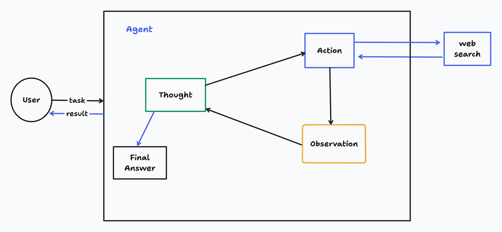

# ReAct Agent with Groq

This project implements a ReAct (Reasoning and Acting) agent using the Groq API. The agent is designed to iteratively think, act, and observe to solve tasks, leveraging external tools for enhanced functionality.



## Features

- **Groq API Integration**: Utilizes the Groq API for language model interactions.
- **External Tool Support**: Includes built-in tools like Wikipedia and DuckDuckGo search, with the ability to add custom tools.
- **Iterative Reasoning**: Performs reasoning and acting in a loop until a solution is found or a maximum iteration limit is reached.
- **Customizable System Prompt**: Allows users to define a system prompt via a `prompt.txt` file.
- **Error Handling and Logging**: Includes robust error handling and logging for debugging and transparency.

## Installation

Follow these steps to set up the project locally:

1. **Clone the Repository**:
   ```bash
   git clone https://github.com/oularefodos/ReAct-AI-Agent-From_scratch.git
   cd react-agent-groq

2. **nstall Dependencies**:
    ```bash
    pip install -r requirements.txt

3. **nstall Dependencies**:
- Create a .env file in the project root.
- Add your Groq API key
    ```bash
    GROQ_API_KEY=your_api_key_here

## Usage
1. **Initialize the Agent**:
    ```bash
    from src.agent import Agent
    from src.tools.wikipedia import wikipedia_search_tool
    from src.tools.duckduckgo import duck_duck_go_search_tool

    # Define the tools
    tools = [wikipedia_search_tool, duck_duck_go_search_tool]

    # Create an agent instance
    agent = Agent(groq_model_name="llama-3.3-70b-versatile", tools=tools)

2. **Call the Agent:**:
    ```bash
    response = agent("What are the latest news about AI?", max_iterations=5)

## Creating Custom Tools
You can define your own tools using the @tool decorator. Here's an example:
    ```bash
    from src.tools.toolClassDecorator import tool
    @tool(
        name="my_custom_tool",
        description="Description of my custom tool",
        args=[("arg1", "str"), ("arg2", "int")],
        outputs="str"
    )
    def my_custom_tool_func(arg1, arg2):
        # Your tool logic here
        return f"Processed {arg1} with {arg2}"
    tools = [my_custom_tool_func]
    agent = Agent(tools=tools)